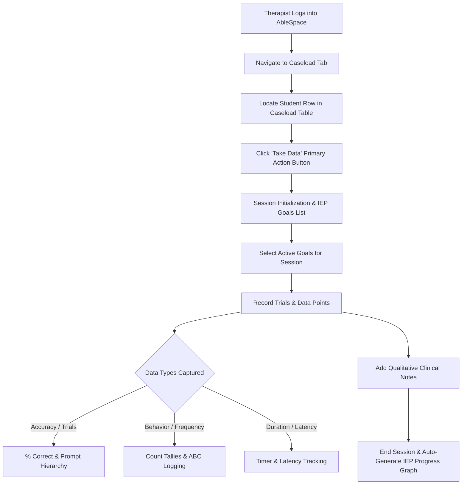

# AbleSpace Product Teardown: "Take Data" Workflow & UX/UI Improvement Strategy

**Author:** Yash Jain  
**Role:** Full Stack Developer Candidate  
**Target Product:** AbleSpace Special Education Platform (Caseload & Clinical Data Collection Module)  
**Date:** August 2026  

---

## 1. Executive Summary & Domain Context

Special Education Teachers, Speech-Language Pathologists (SLPs), Occupational Therapists (OTs), and Board Certified Behavior Analysts (BCBAs) are legally required under **IDEA (Individuals with Disabilities Education Act)** to monitor and document student progress toward specific **IEP (Individualized Education Program)** goals. 

In a typical school district, a single provider manages a caseload of **40 to 60+ students**, conducting **15 to 25 therapy sessions per week**, often in small groups of 2 to 5 students with diverse goals (e.g., expressive language, fine motor grip, phonological awareness, behavioral regulation).

The **"Take Data"** action within the AbleSpace Caseload tab represents the primary operational hub of the platform. It bridges administrative caseload management with real-time clinical data capture.

---

## 2. Current Workflow Mapping: Caseload ➔ Take Data



### Step-by-Step User Journey:
1. **Caseload Identification**: The therapist enters the `Caseload` view, filters by Grade, Service Type, or Scheduled Day, and identifies the target student.
2. **Session Launch**: Clicking the **"Take Data"** button initiates the clinical session context, loading the student’s active IEP objectives, historical baseline, and target mastery criteria (e.g., *"80% accuracy across 3 consecutive sessions with minimal verbal cues"*).
3. **Trial Recording**: During therapy activities (e.g., flashcards, conversational turns, fine motor tasks), the therapist records trial outcomes:
   - **Binary/Trial Data**: Correct (+) / Incorrect (-)
   - **Prompt Levels**: Independent (IND), Verbal (V), Visual (VIS), Gestural (G), Physical/Hand-over-hand (P)
   - **Continuous Data**: Frequency counters, duration timers, or rating scales.
4. **Clinical Documentation**: Adding subjective-objective session notes (SOAP format: Subjective, Objective, Assessment, Plan).
5. **Progress Calculation & Sync**: The system aggregates trial percentages and immediately updates the student's longitudinal IEP trajectory curve.

---

## 3. Heuristic Evaluation & Real-World Friction Points

Through direct workflow simulation and clinical usability heuristics, four primary friction points were identified:

| Friction Point | Clinical Impact | Severity |
| :--- | :--- | :--- |
| **1. Lack of Group Session Simultaneous Tracking** | In schools, therapists rarely see students 1-on-1; 75%+ of sessions are small groups. Having to toggle between individual student tabs introduces high cognitive load and lost data points. | **Critical (P0)** |
| **2. High Tactile Friction during Live Therapy** | Therapists must maintain eye contact, handle physical manipulatives (blocks, flashcards, toys), and manage student attention. Small dropdowns and multi-click forms cause distraction and data lag. | **High (P1)** |
| **3. Offline Fragility in Classrooms & Sensory Rooms** | School Wi-Fi networks in gyms, basements, or outdoor playgrounds frequently drop connection. If session data is not cached locally, session progress can be lost. | **High (P1)** |
| **4. Delayed Progress Visualization** | Providers need instantaneous feedback during the session on whether the student has met their daily threshold or needs adjusted prompt fading. | **Medium (P2)** |

---

## 4. Strategic UX/UI & Functionality Improvements

### Improvement 1: Multi-Student "Group Data Hub" (Split/Carousel View)
- **Concept**: A unified group session mode allowing the therapist to select 2–4 students (e.g., *"Tuesday 10:00 AM Speech Group"*) and display synchronized data tiles on one screen.
- **UX Solution**: Quick keyboard shortcuts (`1`, `2`, `3`, `4`) to switch student focus or simultaneous side-by-side card tiles with rapid tap targets.

### Improvement 2: Single-Tap Prompt Level Quick Selector & Giant Hit Targets
- **Concept**: Eliminate dropdown menus for prompt hierarchies.
- **UX Solution**: Implement a unified 5-button tactile strip:
  $$\text{[IND (Independent)]} \quad \text{[VER (Verbal)]} \quad \text{[GES (Gestural)]} \quad \text{[VIS (Visual)]} \quad \text{[PHY (Physical)]}$$
  - Green tap = Success with prompt level.
  - Red tap = Incorrect trial.
  - Large $48\text{px} \times 48\text{px}$ touch targets optimized for iPad / tablet ergonomics.

### Improvement 3: Voice-to-Data Quick Clinical Logging (Speech-to-Text)
- **Concept**: Integrated Web Speech API microphone icon.
- **Example Voice Input**: *"Alex completed 8 out of 10 /r/ blends with moderate verbal cues."*
- **Action**: Auto-parses trial count ($8/10 = 80\%$), assigns prompt level (*Moderate Verbal*), and inserts into session notes.

### Improvement 4: Real-Time IEP Goal Mastery Micro-Sparklines
- **Concept**: Display a dynamic micro-sparkline above each goal during data collection showing the last 5 sessions alongside the target mastery line (e.g., $80\%$).
- **Value**: Gives therapists instant visual reinforcement on whether to increase task difficulty or fade prompts during the active session.

### Improvement 5: Local-First Offline Resilience (CRDT / IndexedDB)
- **Architecture**: Cache active student caseload and session templates in IndexedDB / local storage. When connectivity drops, session data continues uninterrupted and automatically syncs with conflict-free resolution when back online.

---

## 5. Proposed Information Architecture & Component Wireframe

```
+-------------------------------------------------------------------------------+
| AbleSpace > Caseload > Active Session: Grade 3 Speech Group (3 Students)     |
+-------------------------------------------------------------------------------+
| [⏱ 18:42 Session Timer]   [🎤 Voice Log]   [⚡ Quick Shortcuts: 1/2/3]        |
+-------------------------------------------------------------------------------+
|  STUDENT 1: Alex Morgan       |  STUDENT 2: Samira K.        |  STUDENT 3: Ethan T.   |
|  Goal: /s/ in Initial Position|  Goal: 2-Step Directions     |  Goal: Turn Taking     |
|  Current: 8/10 (80%) 🟢       |  Current: 5/6 (83%) 🟢       |  Current: 4/7 (57%) 🟡 |
|  [----📈 Micro-Sparkline----] |  [----📈 Micro-Sparkline----]|  [----📈 Micro-Sparkline]
|                               |                              |                        |
|  [+] Success  [-] Miss        |  [+] Success  [-] Miss       |  [+] Success  [-] Miss |
|  Prompt: [IND][V][G][VIS][P]  |  Prompt: [IND][V][G][VIS][P] |  Prompt: [IND][V][G][P]|
+-------------------------------------------------------------------------------+
|  Quick Session SOAP Note:                                     [Save & Sync ➔] |
|  "Students engaged well with the articulation board game..."                  |
+-------------------------------------------------------------------------------+
```

---

## 6. Conclusion & Product Vision

By transforming the **"Take Data"** workflow from a transactional table click into an ergonomic, group-aware, local-first clinical assistant, AbleSpace can:
1. **Save 45–60 minutes per week per therapist** in post-session documentation.
2. **Increase data collection accuracy** by reducing memory-based retrospective logging at the end of the day.
3. **Elevate clinician delight and platform retention**, reinforcing AbleSpace as the undisputed gold standard in Special Education workflow software.
