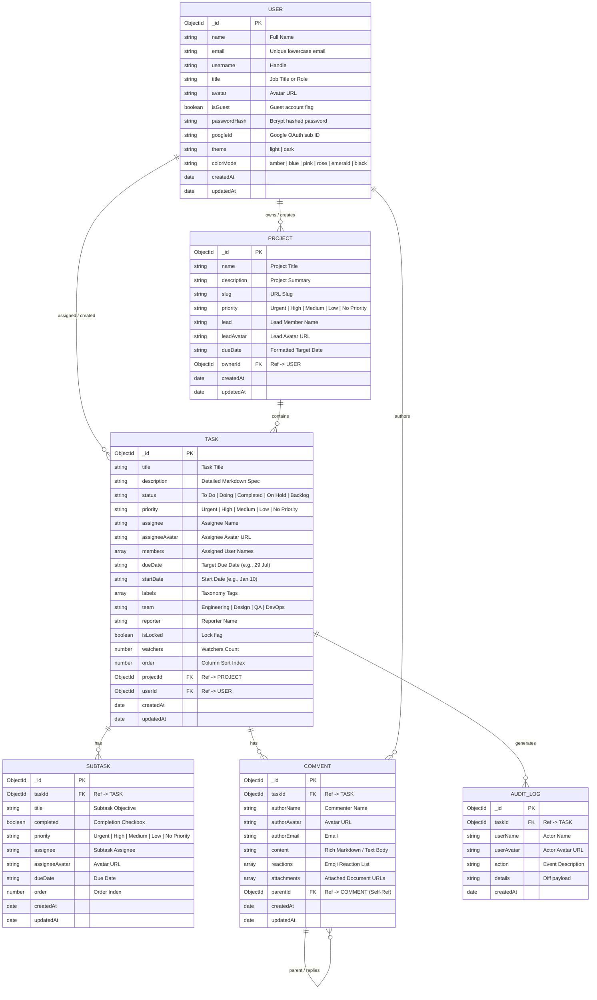

# Taskly Database Architecture & Entity Relationship Diagrams 🗄️

Comprehensive database schema documentation, ER diagrams, indexing strategies, and architectural relationships for the **Taskly Full-Stack System**.

---

## 📊 Entity Relationship Diagram (Mermaid ERD)

---

## ⚡ Indexing & Query Optimization Strategy

| Collection | Compound / Single Index | Purpose |
| :--- | :--- | :--- |
| **`users`** | `{ email: 1 }` *(Unique)* | High-speed authentication lookups & Google OAuth deduplication |
| **`tasks`** | `{ userId: 1, status: 1, order: 1 }` | Fast Kanban board column retrieval and sort order preservation |
| **`tasks`** | `{ projectId: 1 }` | Project-scoped task directory queries |
| **`tasks`** | `{ title: "text", description: "text", labels: "text" }` | Instant `⌘F` full-text search matching |
| **`subtasks`** | `{ taskId: 1, order: 1 }` | Subtasks table ordering and cascade deletions |
| **`comments`** | `{ taskId: 1, createdAt: 1 }` | Threaded activity stream chronological sorting |
| **`audit_logs`** | `{ taskId: 1, createdAt: -1 }` | Real-time updates feed descending audit log |

---

## 🔄 Lifecycle & Cascade Constraints

1. **Task Deletion Cascade**:
   - When a `Task` document is deleted, all associated `Subtasks`, `Comments`, and `AuditLogs` referencing `taskId` are atomically purged via `deleteMany()`.
2. **Audit Trail Automation**:
   - Updates to `Task.priority` or `Task.status` automatically generate and persist an `AuditLog` entry (e.g. *"You changed priority from High to Urgent"*).
3. **Session & Preference Sync**:
   - User `theme` (*light / dark*) and `colorMode` (*amber, blue, pink, rose, emerald, black*) are written to MongoDB on update, ensuring cross-device consistency.
